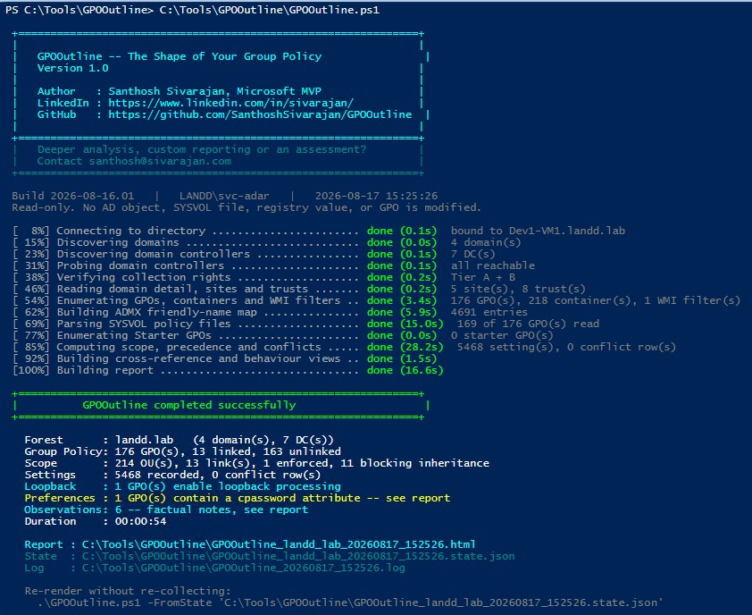
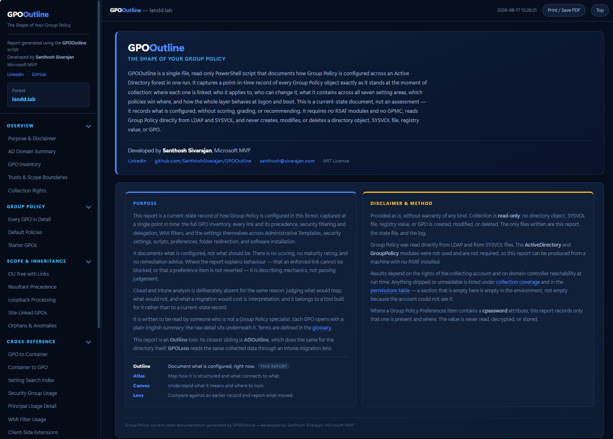
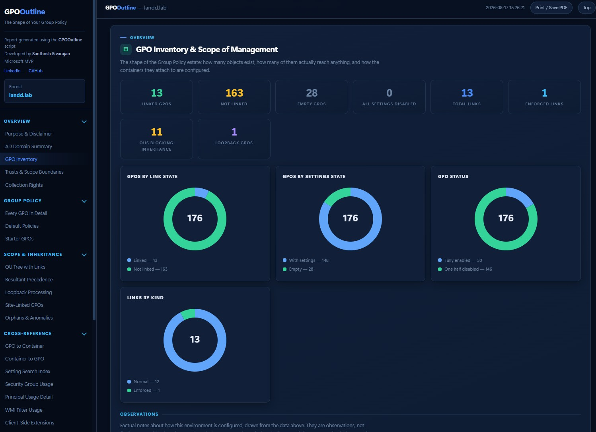
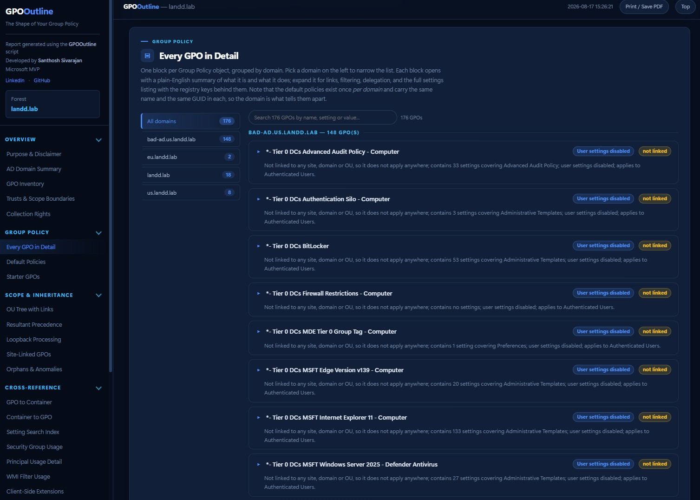
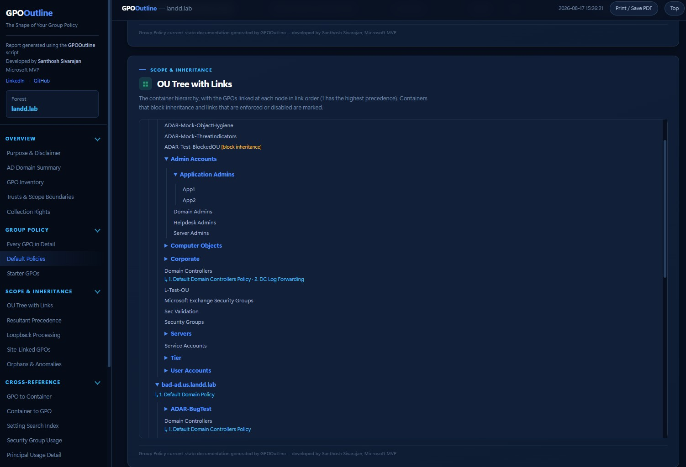
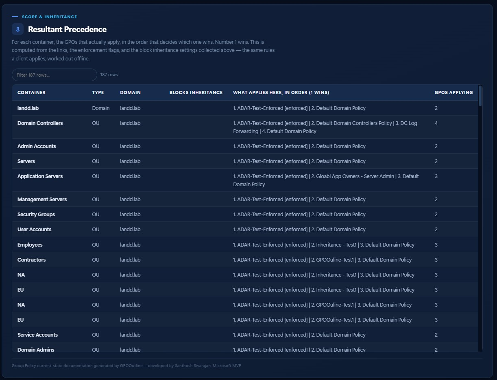
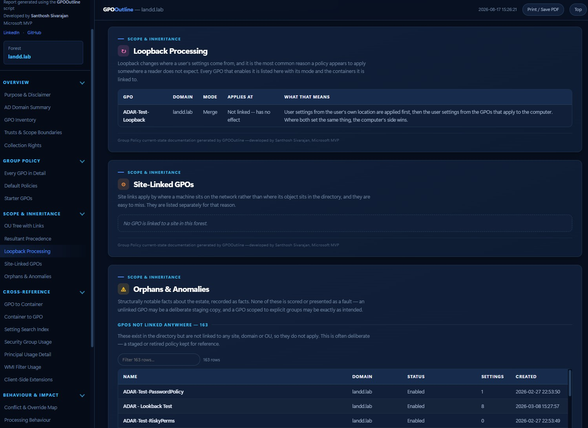
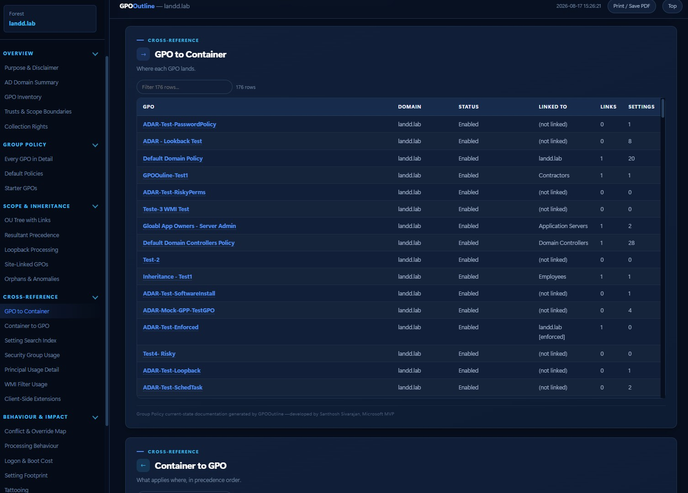
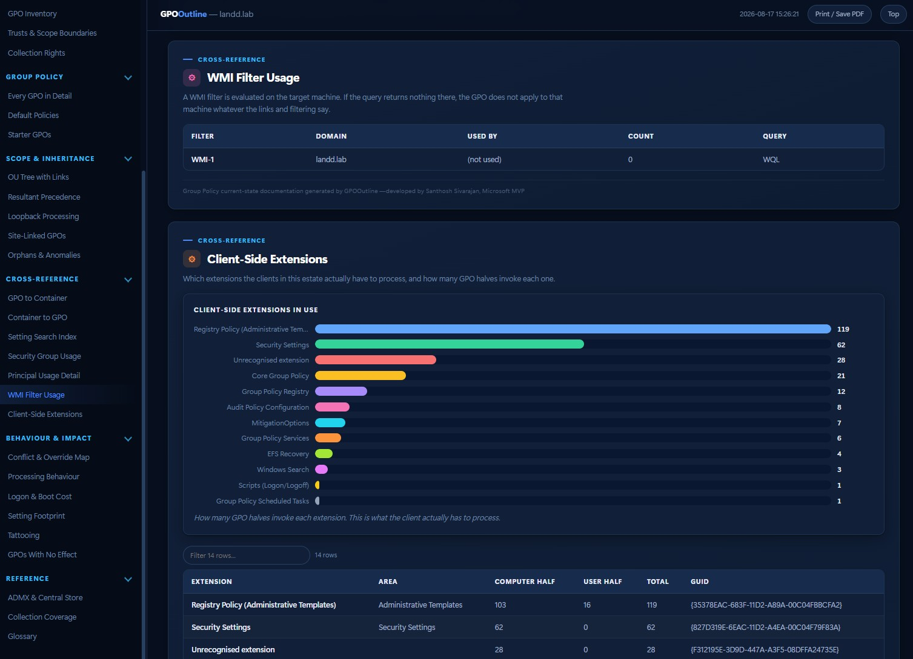
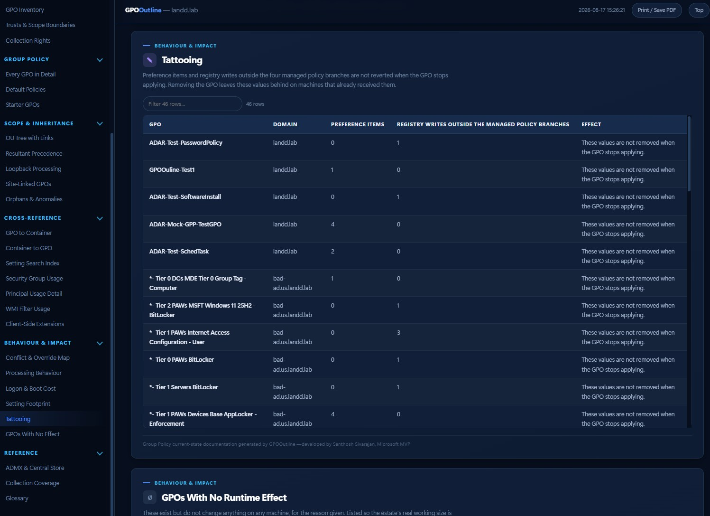

# GPOOutline

### The Shape of Your Group Policy

A single-file, read-only PowerShell script that documents how Group Policy is configured across an Active Directory forest in one run, and delivers it as one self-contained HTML report a non-specialist can actually read.

**No RSAT. No GPMC. No `ActiveDirectory` or `GroupPolicy` module. Nothing is modified.**

---

## Why this exists

Group Policy is the layer everyone depends on and nobody has written down. The settings live in two places that do not look like each other — object metadata in the directory, actual configuration in files on SYSVOL — and the tooling that reads them shows one GPO at a time, on a machine that has the right software installed, to a person who already knows what they are looking at.

So the questions that matter go unanswered:

- What actually applies to a machine in this OU, and which policy wins when two disagree?
- Why is that setting applying here at all?
- Which GPOs do nothing — unlinked, empty, disabled, or filtered to no one?
- Who can edit the policy that controls our workstations?
- What is going to break, or move, or need rewriting if we go to Intune?

GPOOutline answers those in a document you can email, print, hand to an auditor, or open in three years when the person who built it has left.

## Why a single script

It runs where the problem is. One `.ps1`, copied to a jump box or a laptop on a VPN, with no installer, no modules, no admin rights on the collecting machine, and no agent. It produces one `.html` that opens offline with no network access and no external assets, plus a `.json` state file that re-renders that report without touching the directory again.

Nothing is written to Active Directory or SYSVOL. Ever. The only files created are the report, the state file, and the log.

## Where this sits

GPOOutline belongs to the **Outline** series: current-state documentation. Outline tools answer *"what is actually configured here, right now?"* and write the answer down as a single file — no interpretation, no scoring, no recommendations. A record you can hand to an auditor, an acquirer, an incoming team, or your own successor.

| Series | Question it answers |
|---|---|
| **Outline** | What is configured, right now? |
| **Atlas** | How is it structured, and what connects to what? |
| **Canvas** | What does it mean, and where should I look? |
| **Lens** | What changed since last time? |

Its closest siblings:

| Tool | Purpose |
|---|---|
| **[GPOOutline](https://github.com/SanthoshSivarajan/GPOOutline)** | **Document how Group Policy is configured.** |
| [ADOutline](https://github.com/SanthoshSivarajan/ADOutline) | Document the current state of an Active Directory forest. |
| GPOLens | Read Group Policy through an Intune migration lens. *(planned)* |

GPOOutline is a deliberate sibling of ADOutline: same theme, layout, parameter surface, collection-tier model and state-file pattern, so a reader who knows one report can navigate the other without relearning anything. The full set is listed at the [end of this file](#the-wider-tool-set).

The division of labour with GPOLens is intentional. Judging what would map to Intune, what would not, and what a migration would cost is *interpretation* — it belongs to a Lens tool, not to a current-state record. GPOOutline's `state.json` contains every collected setting and is designed to be GPOLens's input, so that tool need not touch a directory at all.

## What it records

**Environment context** — forest and domains, functional levels, domain controllers, PDC emulators, SYSVOL replication engine (DFSR or FRS), sites, trusts, and central ADMX store status per domain.

**Every GPO in detail** — grouped by domain, with a domain rail to narrow the list. This matters more than it sounds: the default policies exist once *per domain* and carry the same name **and the same GUID** in each, so the domain is what tells them apart. Each card shows identity, GUID, created and modified timestamps, status, AD-versus-SYSVOL version with mismatch flagged, every link with order and enforcement, security filtering, delegation, WMI filter with the WQL translated into plain English, client-side extensions, comment, and the GPC and SYSVOL paths for evidence.

**All seven setting areas** — Administrative Templates decoded from the binary `registry.pol` with ADMX friendly names resolved; security settings from `GptTmpl.inf` including account policy, Kerberos, user rights, security options, restricted groups and services; legacy and advanced audit policy; startup/shutdown/logon/logoff scripts; software installation packages; folder redirection; and Group Policy Preferences across every extension.

**Scope and inheritance** — the OU tree with the GPOs linked at each node, resultant precedence per container computed offline from the documented rules, a first-class loopback map with mode and affected scope, site links called out separately, and the default domain policies.

**Cross-reference** — GPO-to-container and container-to-GPO matrices, a searchable index of every discrete setting across every GPO, security group usage, WMI filter usage, and client-side extension usage.

**Behaviour and impact** — the conflict and override map showing which GPO wins where and which are overridden, per-GPO processing flags, synchronous-processing indicators that add logon and boot cost, setting footprint by area, tattooing indicators, and GPOs with no runtime effect.

**Starter GPOs** — enumerated from SYSVOL, with names from the manifest and their settings decoded. They have no directory object, so nothing else in the report can see them; Microsoft-shipped templates are distinguished from locally authored ones.

**SYSVOL folder permissions** — the file-system ACL on each GPO's policy folder, shown beside the AD delegation, with writers named and any principal holding Edit rights in the directory but absent from SYSVOL called out.

**Anomalies** — unlinked and empty GPOs, both-halves-disabled GPOs, version mismatches, GPCs with no SYSVOL folder and SYSVOL folders with no GPC, disabled links, links to missing GPOs, cross-domain links, GPOs that reach nobody, and preference items holding a `cpassword`.

**Run quality** — collection rights proven at run time, a "permissions required by section" table, and a coverage section listing everything skipped or unreadable.

## What it does NOT do

- **No scoring, grading, health ratings, or traffic lights.** Judgement belongs to an assessment.
- **No remediation advice.** It records what is configured, not what should be.
- **No changes.** It cannot write. There is no code path that modifies a directory object, SYSVOL file, registry value, or GPO.
- **No credential recovery.** Where a preference item contains a `cpassword`, GPOOutline records only that one is present and where. It does not decrypt, print, or store the value, and does not ship the published key.
- **No endpoint scanning.** Effective settings are computed offline from collected data, not gathered by contacting workstations.
- **No cloud or Intune analysis.** Mappability, migration sizing, and Settings Catalog equivalence are deliberately out of scope — they are interpretation, not documentation, and belong to a separate tool in the Lens family. GPOOutline's `state.json` contains every collected setting, so it is designed to be consumed as that tool's input.

## Requirements

**Collecting machine**
- Windows PowerShell 5.1 or PowerShell 7.x
- Domain-joined, *or* any Windows host with line of sight to a domain controller when `-Server` and `-Credential` are supplied
- No RSAT, no GPMC, no local administrator rights, no WinRM
- Write access to the output directory

**Network to each domain controller**

| Port | Service | Needed for |
|---|---|---|
| 389/tcp | LDAP | All directory collection |
| 88/tcp | Kerberos | Negotiate authentication |
| 445/tcp | SMB | SYSVOL parsing (Tier B) |

Closed ports are detected at startup; affected sections are marked unavailable rather than retried.

## Collection tiers

| Tier | Source | Minimum rights | Covers |
|---|---|---|---|
| **A** | LDAP | Domain User | Inventory, links, scope, precedence, filtering, delegation, WMI filters, CSEs |
| **B** | SYSVOL files | Domain User (SYSVOL read) | All settings, effective policy, conflicts, migration lens |
| **C** | GPMC cross-check | RSAT present *(optional)* | Confidence check only; absence changes nothing |

A standard domain user gets essentially the whole report. Where a right is missing, the affected sections say so — an empty section means an empty environment, never an unreadable one.

## Usage

```powershell
# Whole forest, from a domain-joined machine
.\GPOOutline.ps1

# From a non-domain-joined machine
.\GPOOutline.ps1 -Server dc01.contoso.com -Credential (Get-Credential)

# Scope to specific domains, into a chosen folder
.\GPOOutline.ps1 -Domain corp.contoso.com,emea.contoso.com -OutputPath C:\Reports

# Limit to an OU subtree
.\GPOOutline.ps1 -SearchBase "OU=Europe,DC=contoso,DC=com"

# See the size of the job before committing to it
.\GPOOutline.ps1 -WhatIfScope

# Fast metadata-only pass: scope and links, no settings
.\GPOOutline.ps1 -SkipSysvol

# Gentle on a busy DC
.\GPOOutline.ps1 -MaxConcurrency 4 -ThrottleDelayMs 50

# Re-render an existing report without touching the directory
.\GPOOutline.ps1 -FromState .\GPOOutline_contoso_com_20260816_141500.state.json
```

## Parameters

| Parameter | Default | Purpose |
|---|---|---|
| `-Server` | current domain | Target DC or domain |
| `-Credential` | current user | Enables non-domain-joined collection |
| `-Domain` | all in forest | Scope to specific domains |
| `-SearchBase` | domain root | Limit OU/link collection to a subtree |
| `-Mode` | `Auto` | `Auto`, `Raw`, or `Native` |
| `-OutputPath` | script folder | Output directory |
| `-MaxConcurrency` | CPU count, cap 16 | Parallel SYSVOL workers |
| `-ThrottleDelayMs` | `0` | Inter-batch delay, smooths DFSR I/O |
| `-PageSize` | `1000` | LDAP page size |
| `-LdapTimeoutSec` | `30` | Hard ceiling per LDAP operation |
| `-SkipSysvol` | off | Metadata-only fast pass |
| `-IncludeSites` | `$true` | Include site-linked GPOs |
| `-ResolveAdmx` | `$true` | Resolve ADMX friendly names |
| `-WhatIfScope` | off | Report the work list, then stop |
| `-FromState` | — | Re-render from a state file, no directory access |
| `-NoHtml` / `-NoState` | off | Suppress either output |
| `-NoEmbeddedJson` | off | Smaller HTML, no embedded dataset |
| `-ExcludeDC` | — | Do not contact these controllers |
| `-NoProbe` | off | Skip the reachability probe |
| `-ShowDetail` | off | Echo detail to the console |
| `-LogPath` | output folder | Explicit log path |

## Design notes

**Module-free by design.** Everything Group Policy lives in two reachable places: GPC metadata over LDAP, and GPT settings as files on SYSVOL. `System.DirectoryServices.Protocols` reads the first and plain file I/O reads the second. The modules are convenience wrappers, not the only door — dropping them is what lets this run from a locked-down or non-domain-joined box. Where GPMC happens to be installed it is used only as an optional cross-check, never as a requirement.

**The parsers are ours.** A binary `registry.pol` (PReg) decoder, `gPLink`/`gPOptions` parsing, the precedence and loopback engine, ADMX/ADML resolution, security descriptor decoding, GPP XML, and the INI formats. The PReg decoder and the precedence engine are unit-tested against fixtures and synthetic trees, because they are the two components where a quiet error would produce a confident, wrong report.

**A GPO GUID identifies a GPO within a domain, not across a forest.** Every domain has a Default Domain Policy carrying the identical `{31B2F340-…}` GUID. Every index, lookup and result key in this script is therefore domain-qualified, and links resolve through the domain named in the link's own DN — which is also what makes a genuine cross-domain link bind to the right object.

**Precedence is computed, not guessed.** L-S-D-OU layering, link order within a container, block inheritance, enforced-beats-block, and highest-enforced-wins are implemented from the documented rules and tested against synthetic trees covering each.

**Built for scale.** Discovery-then-collect with a real progress denominator, LDAP paging with attribute scoping, one DC bound per domain for the whole run (so the report is a coherent point-in-time view, and the DC used is recorded), parallel SYSVOL parsing with an AIMD adaptive throttle that backs off when latency rises, memoised SID and ADMX lookups, and hard timeouts everywhere.

**Collection owns the state; display only reads it.** Everything collected serialises to `state.json`; the renderer consumes only that. `-FromState` is therefore a complete re-render with zero directory access — and the seed for future diffing and for downstream tools such as GPOLens, which can read the same state rather than re-collecting.

**Documentary voice throughout.** The report explains mechanics — that an enforced link cannot be blocked, that a preference item is not reverted — without passing judgement on them. An unlinked GPO may be a deliberate staging copy. A GPO scoped to explicit groups may be exactly as intended. The report says what is there and leaves the verdict to a human.

## Output

Three files per run, in the output directory:

```
GPOOutline_<forest>_<stamp>.html         self-contained report, no external assets
GPOOutline_<forest>_<stamp>.state.json   full dataset; re-renders via -FromState
GPOOutline_<stamp>.log                   structured per-phase collection log
```

State files written before v1.0's domain-qualified GPO key are upgraded on load by `-FromState`, with a notice recommending a fresh collection.

The HTML opens offline, prints to a clean PDF, and carries no CDN, external font, script, or stylesheet reference.

## Contributing

Bug reports that include the log file are worth more than feature requests. If a section is wrong or a parse fails on a GPO shape not covered here, the log names the GPO and the file. Known limitations are recorded honestly in `TESTNOTES.md` rather than quietly omitted.

## A note on the name

**GPOOutline**, not GPOutline. `ADOutline` is `AD` + `Outline`; this is `GPO` +
`Outline`. The doubled `O` is the join between the two words, and is deliberate.

## Author

**Santhosh Sivarajan**, Microsoft MVP
[LinkedIn](https://www.linkedin.com/in/sivarajan/) · [GitHub](https://github.com/SanthoshSivarajan) · santhosh@sivarajan.com

Need more than documentation? This report records the current state and stops there, deliberately. For findings interpreted, a Group Policy consolidation or remediation plan, an Intune migration design, or a formal assessment — get in touch.

## License

MIT. Copyright (c) 2026 Santhosh Sivarajan.

Provided as is, without warranty of any kind. Collection is read-only. Results depend on the rights of the collecting account and on controller reachability at run time. Validate all findings before acting on them.

---


###


###


###


###


###


###


###


###


###


###


---


## The wider tool set

Four series, each answering a different question about the same estate. Active Directory and identity systems are often the oldest and least documented parts of an environment — upgraded, merged and inherited across decades and staff changes until nobody can fully describe what is there. That gap becomes expensive during an acquisition, a migration, an audit, or a handover. These tools close it.

All are authored by **Santhosh Sivarajan** and published at **[github.com/SanthoshSivarajan](https://github.com/SanthoshSivarajan)**.

### Outline — current-state documentation

*What is actually configured here, right now?* Written down as a single self-contained file, in a form a non-specialist can read. No scoring, no grading, no remediation advice; the judgement is left to an assessment.

| Tool | What it does |
|---|---|
| **GPOOutline** | Documents how Group Policy is configured across a forest — inventory, links, precedence, filtering, delegation, all seven setting areas, conflicts, loopback, Starter GPOs and SYSVOL permissions. *(this tool)* |
| **ADOutline** | Documents the current state of an Active Directory forest: topology, object populations, identity platform integrations, security-relevant configuration and forest lineage. 47 sections and 11 diagrams in one HTML file, in about twenty seconds. No RSAT; collects from a non-domain-joined machine. |

### Atlas — structure and mapping

Point-in-time maps of how systems are put together: structure, relationships and configuration, without analysis or scoring.

| Tool | What it maps |
|---|---|
| **ADAtlas** | Active Directory: forest structure, domains, sites, trusts and supporting services in one self-contained view. |
| **EntraAtlas** | Microsoft Entra ID: tenants, identities, roles, applications and access relationships. |
| **M365Atlas** | Microsoft 365: Exchange Online, SharePoint, OneDrive, Teams and service configuration. |
| **DefenderAtlas** | Microsoft Defender across Endpoint, Identity, Office 365 and Cloud Apps, including security configuration and coverage. |
| **IntuneAtlas** | Microsoft Intune: device configuration, compliance policies, application deployments and enrollment structure. |
| **PKIAtlas** | AD Certificate Services: certificate authorities, templates, trust stores and issuance structure. |
| **IdentityAtlas** | Identity systems across on-premises and cloud, as one structural view of identities, roles and relationships. |

### Canvas — understanding and analysis

Structured visibility into identity systems: relationships, configuration, and the areas that warrant attention.

| Tool | What it shows |
|---|---|
| **ADCanvas** | Active Directory structure, relationships and operational context. |
| **EntraIDCanvas** | Microsoft Entra ID identities, roles and access relationships. |
| **DelegationCanvas** | Delegated permissions across organizational units, including explicit access and potential risk. |
| **ZeroTrustCanvas** | Zero Trust architecture within identity systems: access boundaries, controls and policy enforcement. |
| **NHICanvas** | Non-human identities — service accounts, applications and automation identities — with their access, usage and posture. |
| **AttackPathCanvas** | Identity attack paths: privilege escalation routes, lateral movement risk and credential exposure chains. |
| **M365Canvas** | Microsoft 365 including Exchange Online, SharePoint, OneDrive, Teams, and security configuration such as DLP policies and sensitivity labels. |
| **DefenderCanvas** | Microsoft Defender posture across Endpoint, Identity, Office 365 and Cloud Apps, including threat policies and detection coverage. |
| **IntuneCanvas** | Microsoft Intune device policies, compliance status, application deployments, configuration profiles and enrollment settings. |

### Lens — change over time

Compares an environment against an earlier record of itself, so configuration drift is reported rather than assumed.

| Tool | What it compares |
|---|---|
| **ADLens** | How an Active Directory forest changes over time: two point-in-time records, and what moved between them. |
| **GPOLens** | Group Policy against an Intune target — mappability, on-premises-only settings and targeting-model translation. Consumes a GPOOutline state file. *(planned)* |

> Individual repository links are omitted where a tool is not yet public. Start at
> [github.com/SanthoshSivarajan](https://github.com/SanthoshSivarajan) for whatever is currently available.
